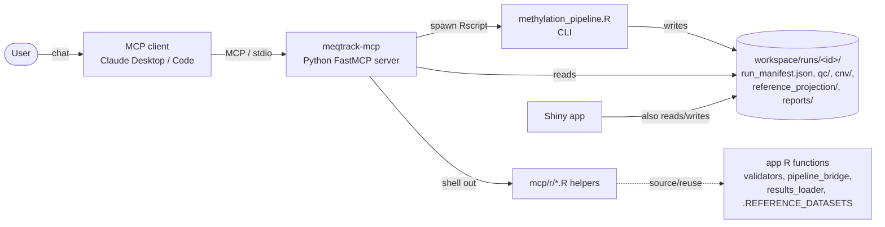
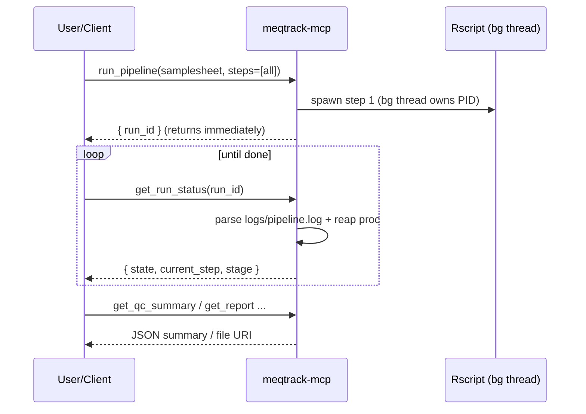

# MeQTrack MCP server — design

> Chat-driven control of the MeQTrack methylation pipeline. This document is
> the design/plan; see [`README.md`](README.md) for install & usage.

---

## 1. Why

MeQTrack is an R/Shiny desktop app over a headless methylation pipeline. We
want a user to **chat** — *"validate this samplesheet"*, *"run QC then CNV"*,
*"what's the nearest reference class for sample X?"* — and have the work happen.

The enabler: the pipeline is already a clean, parameterized **CLI**
(`pipeline/methylation_pipeline.R`) with **structured run outputs** and a
`run_manifest.json`, fully decoupled from the UI. So the MCP server is a *thin
adapter* over the existing engine — **no pipeline or UI rewrite**.

---

## 2. Architecture



Plain-text view:

```
User → MCP client → (stdio) → meqtrack-mcp ──spawn──► Rscript methylation_pipeline.R
                                   │                         │ writes
                                   │ shell out               ▼
                                   └──► mcp/r/*.R ──►  workspace/runs/<id>/  ◄── Shiny app
                                        (reuse app R fns)     (manifest, results, report)
```

**Key properties**
- The server **owns the OS subprocess** — it does *not* reuse the app's
  `callr`-based `bridge_launch` (that handle is tied to a live R session).
- Runs land in the **same workspace** as the GUI, so chat runs appear in the
  app's *Past runs* tab and vice-versa.
- R logic is **reused, never reimplemented**: the helpers `source()` the app's
  own functions.

---

## 3. Components

| Layer | File(s) | Responsibility |
|-------|---------|----------------|
| MCP tools | `meqtrack_mcp/server.py` | FastMCP tool definitions (the chat surface). |
| Run lifecycle | `meqtrack_mcp/pipeline.py` | Spawn `Rscript`, track subprocess, status, cancel, manifest. |
| Results | `meqtrack_mcp/results.py` | Read CSV/HTML outputs; invoke R summarizers. |
| Config | `meqtrack_mcp/config.py` | Project/workspace paths, Rscript env. |
| R helpers | `mcp/r/*.R` | The thin R bridge that reuses app functions. |

### R helpers reuse map (single source of truth)

| Helper | Reuses | From |
|--------|--------|------|
| `datasets.R` | `.REFERENCE_DATASETS` | `pipeline/pipeline_modules/reference_projection.R` |
| `validate.R` | `read_samplesheet`, `validate_rows`, `validation_summary`, `detect_array_from_samplesheet` | `app/R/validators.R`, `app/R/array_detect.R` |
| `write_run_config.R` | `.write_run_config` (flat→nested params) | `app/R/pipeline_bridge.R` |
| `summarize.R` | `load_results_bundle` | `app/R/results_loader.R` |

> Note: `write_run_config.R` calls the existing `.write_run_config()` rather
> than refactoring it — **zero change to the released app**. The coupling is
> documented here and in the helper.

---

## 4. Pipeline contract (what the server drives)

**CLI** — `Rscript pipeline/methylation_pipeline.R`:

```
--input <samplesheet.csv>   --output <run_dir>      --data_dir <pipeline/data>
--array_type {auto|450k|EPIC|EPICv2}   --threads <n>
--step {all|preprocess|qc|filtering|dim_reduction|reference_projection|cnv|visualization}
--config <run_config.R>     # per-run tuning overrides (optional)
```

**Run outputs** (under `run_dir`):

```
run_manifest.json                                   ← durable record (shared schema)
logs/pipeline.log                                   ← stdout/stderr (status parsing)
processed_data/preprocessed_data.RData, *.txt
qc/sample_qc_report.csv                             ← get_qc_summary  (CSV)
dimensionality_reduction/*.RData
reference_projection/reference_projection_class_hints_<dataset>.csv  ← get_reference_class_hints (CSV)
cnv/cnv_results.RData                               ← get_cnv_summary (via R)
reports/methylation_analysis_report.html            ← get_report
```

---

## 5. Async run model

Pipeline runs take minutes; MCP tools are request/response. So:



- `run_pipeline` returns a `run_id` at once; a background thread runs the
  requested steps **sequentially** against one run dir.
- Upstream prerequisites are enforced per step (mirrors `STEP_PREREQS` in
  `app/R/run_controller.R`); `--step` is single-valued so multi-step =
  sequential launches.
- `run_manifest.json` (same schema as `pipeline_bridge.R`) is the durable
  record; `get_run_status` falls back to it if the run isn't in memory.

---

## 6. Tool surface

| Tool | Backed by | Returns |
|------|-----------|---------|
| `list_reference_datasets` | `datasets.R` | keys, labels, class column |
| `validate_samplesheet(path)` | `validate.R` | per-row status + array type |
| `run_pipeline(samplesheet, steps, array_type, threads, params)` | spawn `Rscript` (+`write_run_config.R`) | `run_id` |
| `get_run_status(run_id)` | log + process state | state, step, stage |
| `list_runs()` | scan manifests | runs + state |
| `cancel_run(run_id)` | terminate subprocess | ok |
| `get_qc_summary(run_id)` | `qc/sample_qc_report.csv` | pass/fail per sample |
| `get_reference_class_hints(run_id)` | class-hints CSV | nearest class + flags |
| `get_cnv_summary(run_id)` | `summarize.R` | gain/loss per sample |
| `get_report(run_id)` | `reports/*.html` | path / `file://` URI |

---

## 7. Scope

**In scope (v0.1):** the tools above; runs shared with the app workspace;
samplesheet validation; tuning via `params`.

**Out of scope (later):** in-app chat panel (Shiny + Anthropic API tool-loop);
MCP *resources* for figure/PDF artifacts; auth / remote (HTTP/SSE) transport;
richer `.RData` summaries (full segment tables, embedding coordinates).

**Repo placement:** lives in this repo under `mcp/` (monorepo) so changes to
the CLI contract and the server are atomic. Extract to a standalone repo only
if it ever needs an independent release lifecycle.

---

## 8. Verification

1. `validate_samplesheet` on the bundled example → array `EPIC`, all rows `OK`.
2. `run_pipeline(steps=["preprocess"])` on the example → poll to `completed`
   → `processed_data/preprocessed_data.RData` exists.
3. Full `["all"]` run → `get_qc_summary`, `get_reference_class_hints`,
   `get_report` return sensible data.
4. Register in Claude Desktop / Code; drive it by chat.
5. Release zip excludes `mcp/`.
6. `pytest mcp/tests` green (`MEQTRACK_RUN_SLOW=1` for the end-to-end run).
